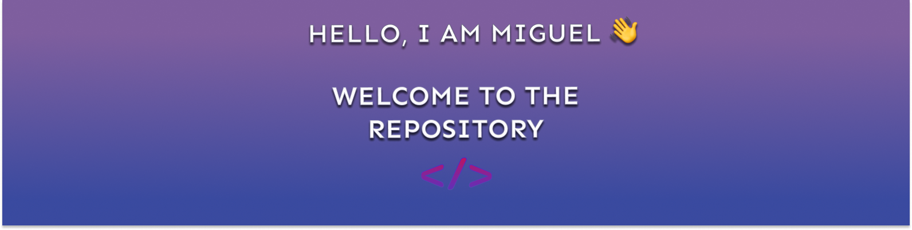
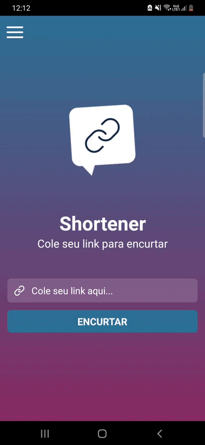

## Projeto

Participei do WorkShop, chamando React Native Insider 3.0, no qual foi desenvolvido um aplicativo do extremo ZERO até o AVANÇADO.
Foi muita mão na massa, bastante código e claro muito conhecimento adquirido.

<h1 align="center"> App Shortener</h3>

  

## Descrição:
A aplicação feita neste no workshop, se trata de um aplicativo que tem a função de encurtar links, ou seja, cada vez que você copiar e colar um link no App, e clicar no botão de GERAR, ele vai gerar um novo link com o caminho encurtado. A ideia do App é fazer com que o caminho do link seja mais curto, pois as vezes tem links com o caminho muito grande,o que prejudica a visualização do usuário, e esse aplicativo resolve esse problema de forma rápida e eficaz. Acrescentei uma nova estilização, mudando as cores do aplicativo, deixando ele diferente do original, que era da cor verde.

## Libs usadas:
* Axios
* styled-components
* linear-gradient

## API:
* API do Bitly

## WorkShop finalizado dia 04/06/2021.

Instrutor: Matheus Fraga  

